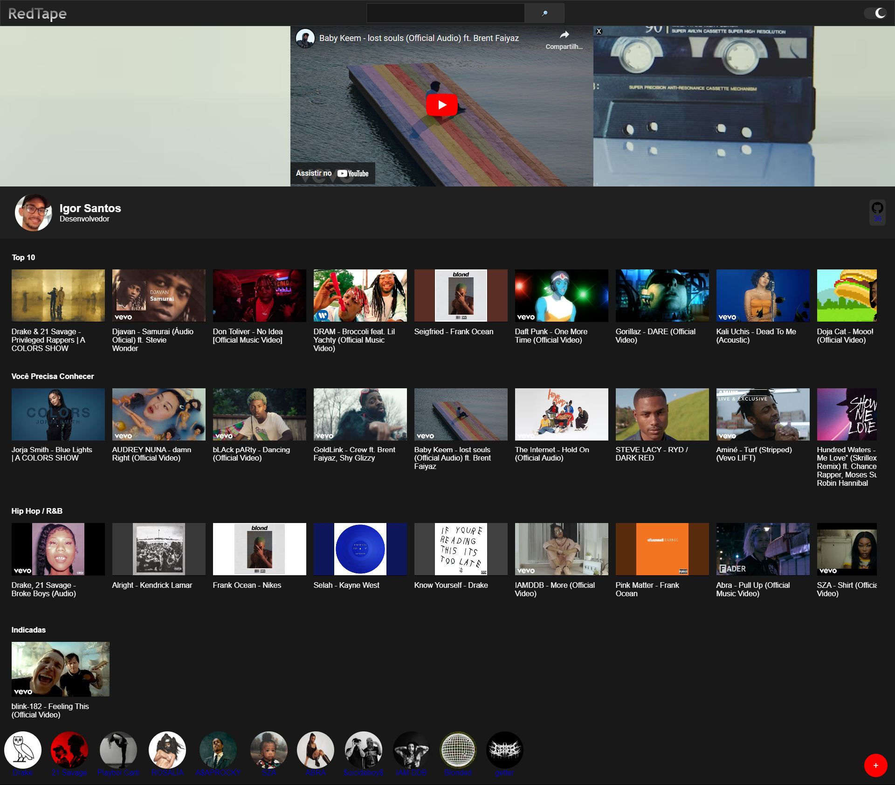
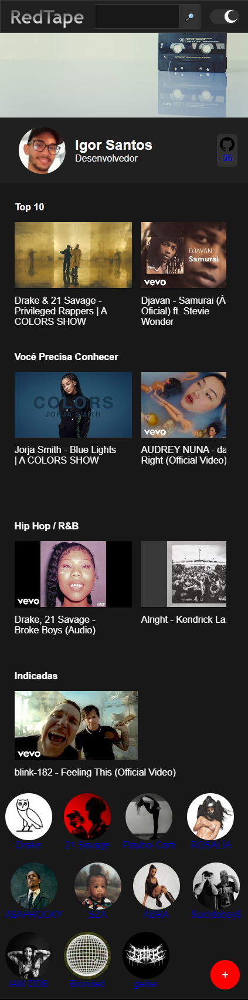
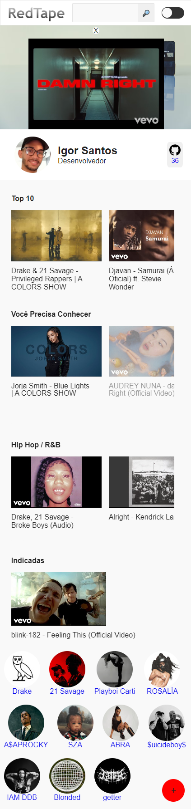

# RedTape | Imersão Alura

[RedTape](https://red-tape.vercel.app) é um site para organizar seus videos favoritos em playlists. O site conta com dark mode e a possibilidade de adcionar videos a playlist.

<details>
<summary>
<b>Imagens</b>
</summary>
    
    
    
</details>
<br>

# Sobre
## 📦 Pacotes

- [Node.js](https://nodejs.org/en/)
- [Next.js](https://nextjs.org)
- [React.js](https://reactjs.org)
- [Styled Components](https://styled-components.com)
- [Supabase](https://supabase.com)

# Instalação

### ✔️ Pré-Requisitos:

- [Node.js](https://nodejs.org/en/)
- [npm](https://www.npmjs.com)

Rode os seguintes comandos abaixo em seu terminal:

```
#Clonando o repositório
> git clone https://github.com/igorsans/RedTape.git

#Acessado o diretorio
> cd RedTape

#Instalando dependências
> npm install

#Rodando o projeto
> npm start
```
